```{r}
#| echo: false
library(countdown)
```


## {.center}

[Course materials can be found at:]{.large}  
[https://github.com/USFWS/intro-to-quarto](https://github.com/USFWS/intro-to-quarto) [](https://github.com/USFWS/intro-to-quarto).

::: {.notes}
- Welcome to Introduction to Quarto!
- You can find all the course materials at the website listed here.
- That includes the presentation slides, the exercise instructions, and a compilation of helpful resources to get you started with using Quarto.  
:::


## Outline

1. Overview of Quarto (30 mins)
2. YAML metadata (20 min)  
3. Document body (30 min)
4. Code blocks (30 min)  
5. Final exercise and wrap-up (30 min)

::: {.notes}
- This workshop serves as an introduction to using Quarto to create scientific reports.
- It is taylored toward the needs of FWS staff.
- During our time here, we will provide a brief overview of what Quarto is, what it can do for you, and how it compares to R Markdown. We will then dive into the anatomy of a Quarto file, which can be broken into three primary components: the YAML metadata, the document body, and code blocks (or code "chunks").
- The workshop structured as a series of four short presentations followed by hand-on exercises to practice what you've learned.
- Instructors are available to provide help during the exercises, so let us know by raising your hand (in person or virtually!)
:::


# Exercises {.exercise}

{width=8 .center fig-alt="QR code to the exercises website."}

::: {.notes}
- When you see a green slide like this, it will be your turn to practice what you've just learned. 
- These slides include a link to the exercise instructions on the workshop website. 
- You can also access the exercise instructions on your phone using a QR code.
:::


## Sticky notes

::: {.center}

::: columns

::: {.column width="40%"}

### [Red]{style="color:red;"}  
"Help!"  

{width=600 fig-alt="A person sitting at a desk at a laptop computer. The laptop has a red sticky note attached to the back of the monitor." .drop}
:::

::: {.column width="60%"}

### [Blue]{style="color:blue;"}  
"All done!"

{width=600 fig-alt="A person sitting at a desk at a laptop computer. The laptop has a red sticky note attached to the back of the monitor." .drop}
:::
:::

:::

::: {.notes}
- As I mentioned earlier, instructors will be available to offer help during the exercises.
- For in-person participants: If you have a question or need help, raise your hand or put a red sticky note on your laptop.
- If you are done with the exercises, you can tell us by putting a blue sticky note on your laptop.
- For online participants- raise your virtual hand or send a message if you are done.
- You are welcome to work on your own or with a partner on exercises!
:::


# The powers of <br> {width=600 fig-alt="Superman holding a pencil with city buildings in the background and Quarto written below him"} {.dark}

::: {.notes}
- Ok, let's dive into the world of creating documents using Quarto.
- First off, you might be wondering: what exactly is Quarto?
- Quarto is an open-source scientific and technical publishing system.
- It allows you to analyze data, weave together code output with text, and publish your story in multiple formats.
- It's quite powerful!
:::

#

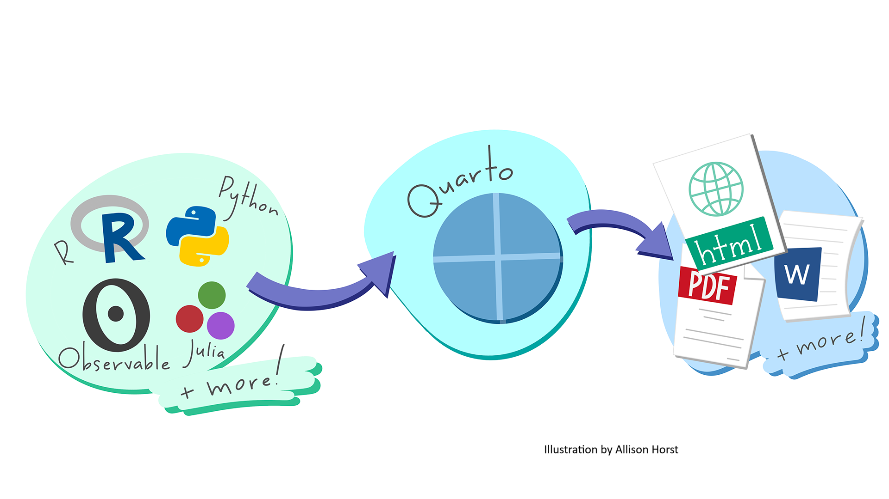

::: {.notes}
- What can you do with Quarto?
    - Quarto can generate dynamic output from code like R and Python, and other languages that can be easily updated when the data change.
    - It has support for equations and citations.
    - Quarto integrates well into RStudio and other code editors.
- It allows you to have a single efficient platform for visualizing, analyzing, and reporting on your scientific data.
:::


## Outputs: [Documents]{.gray-bold}

::: {.center}

:::

::: {.notes}
- Quarto can produce high quality documents in numerous file formats, including HTML, PDF, MS Word, and PowerPoint.
- In addition, Quarto has the ability to output standardized and professional-looking content through the use of templates.
- Here you can see a refuge salmon escapement report, that follows a commonly used AK refuge reporting template.
:::


## Output: [Websites]{.gray-bold}

```{=html}
<iframe width="1600" height="800" src="https://usfws.github.io/Science_Applications_Metadata_Guidance/" title="USFWS Science Applications Metadata Guidance"></iframe>
```

::: {.notes}
- Quarto can also create websites, such as this Science Applications Metadata Guidance.
- In fact, our course website today was created using Quarto!
:::


## Outputs: [Presentations]{.gray-bold}

```{=html}
<iframe width="1600" height="800" src="https://usfws.github.io/data-workflow-presentation/#/a-reproducible-data-workflow/" title="Presentation slides from a Reproducible Data Workflow presentation"></iframe>
```

::: {.notes}
- Quarto can also output professional-looking presentations, formatted as HTML-based Revealjs presentations or as PowerPoint. Presentation templates are available online or with a little CSS code, you can create your own.
:::


## Quarto: [Under the hood]{.gray-bold}

::: {.center}
{width=800}
:::

::: {.notes}
- How does it do all that?
- Over the next few slides, I'll walk through the process that Quarto takes to creating documents.
- Let's take a look under the hood of the Quarto rendering process!
:::


# 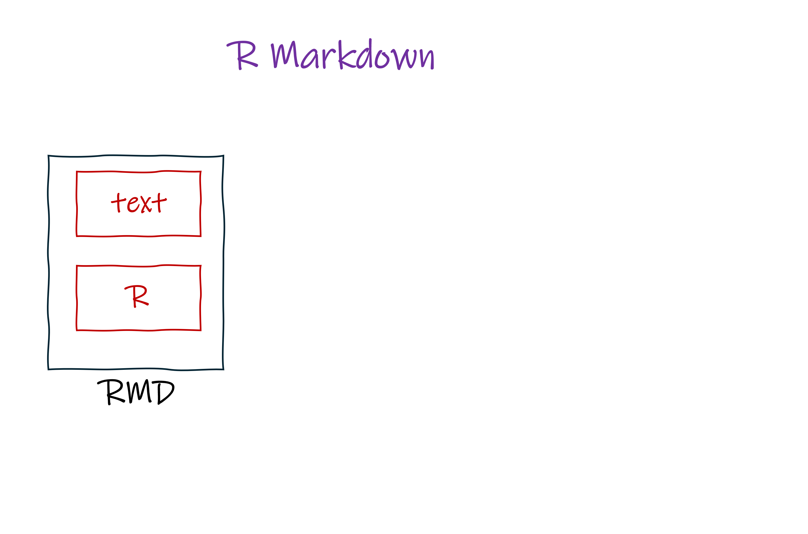{height=1000 fig-alt="A diagram showing the process of rendering a document using R Markdown."}

::: {.notes}
- You may have heard of R Markdown as a tool for authoring documents from R. 
- In fact, Quarto and R Markdown follow a similar process.
- Therefore, let's look at how Quarto compares with R Markdown.
- An R Markdown file contains text and generally R code. While it is possible to include other coding languages in an R Markdown file, using other languages in R Markdown, like Python, requires R package dependencies to interface with Python code.
:::


# 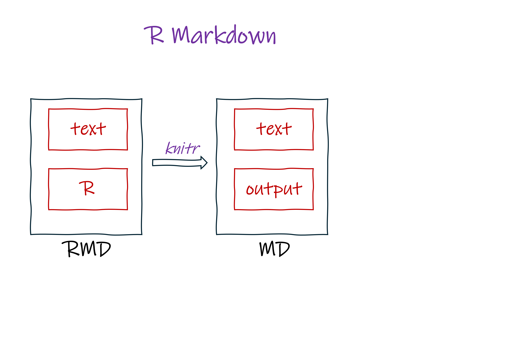{height=1000 fig-alt="A diagram showing the process of rendering a document using R Markdown."}  

::: {.notes}
- When you render an R Markdown file, an R package named "knitr" calls a similarly named engine to execute your R code.
- The result is a Markdown file that include your original text and the output of your code. 
- Markdown is a human-readable language that allows you to add formatting (like headings, paragraphs and images) to a plain text document.
::: 


# 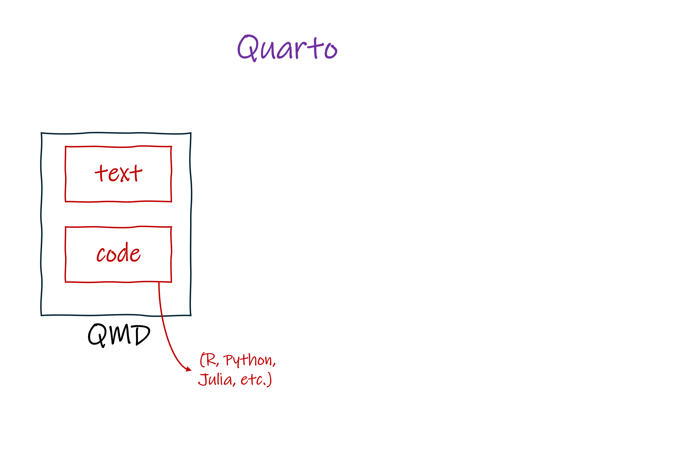{height=1000 fig-alt="A diagram showing the process of rendering a document using Quarto."}  

::: {.notes}
- The first step of rendering a Quarto document is similar to R Markdown, with some notable differences. 
- Like R Markdown, a Quarto file can be composed of text and code.
- However, there is more flexible in Quarto to directly execute additional languages, including Python and Julia. 
- It is not R focused.
- How does it do this?
:::


# 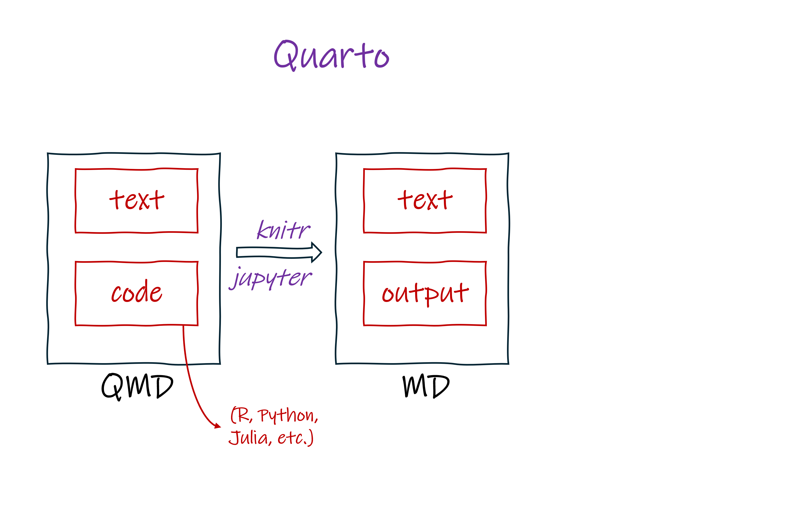{height=1000 fig-alt="A diagram showing the process of rendering a document using Quarto."}  

::: {.notes}
- When you render a Quarto document, Quarto assigns an engine to execute code.
- The engine will be either knitr, like R Markdown, if the code is R, or Jupyter, if other coding languages like Python are detected in the Quarto file.
- By directly calling Jupyter to run Python code, Quarto avoids having use R packages to run non-R code.
- Regardless of whether knitr or Jupyter are used, the text and output of your code are then outputted as an Markdown file, just like R Markdown.
:::


# 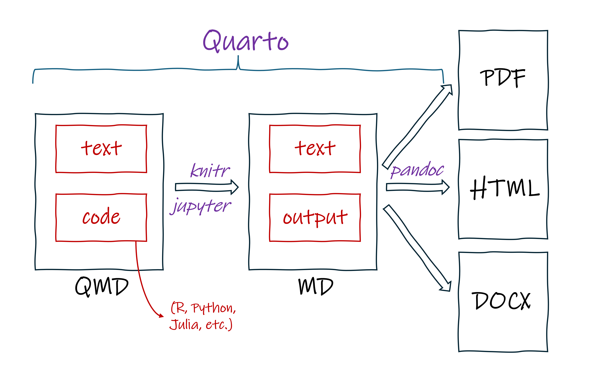{height=1000 fig-alt="A diagram showing the process of rendering a document using Quarto."}  

::: {.notes}
- The final step in rendering a Quarto file is identical to R Markdown.
- Quarto passes the Markdown document to a program called Pandoc that converts your Markdown file into whatever file format you’ve specified, like a PDF or Word doc.
- A notable difference with Quarto though is that it accomplishes all these steps independently from the R ecosystem. You can even run Quarto directly from the command-line interface (i.e., the shell or terminal), if you want to. 
- This feature provides the advantages of freeing Quarto of R and the many of the R package dependencies that tie R Markdown to R.
- It also allows you to collaborate with your friends that only use Python, because they too can contribute code to a Quarto file.
:::


## When and why to use Quarto

::: columns

::: {.column width="40%"}

\
\

::: {.incremental}
- [x]  Weave together text, plots, tables, and statistics 
- [x]  Frequently re-create a standardized document 
- [x]  Create multiple formats of a document 
:::

:::

::: {.column width="60%"}
{height=800 .center fig-alt="An cartoon of a snowy plover thinking. There is a question mark above it's head."}
:::

:::

::: {.notes}
- Now you have a sense of what Quarto is and what it can do for us, you might be wondering, when should I use Quarto and when should I stick with my current approach, such as using Microsoft Word, Excel, and PowerPoint?  
[click]  
- As I mentioned, a unique feature of Quarto is the ability to seamlessly weave together text and code output.  
- If your current project workflow involves combining text, tables, plots, and statistical output in a single document, then using Quarto can offer you a more efficient and reproducible approach then a traditional approach, which might look something like writing text in a Word document, creating figures and tables in R or Excel, creating maps in ArcGIS Pro, and then copy/pasting everything together back into Word.
- Therefore, if you are working on reports that contain text, plots, tables and statistical results, you should consider using Quarto.  
[click]  
- A second situation that FWS scientists commonly encounters is re-creating documents in a standard format. An example of this would be an annual survey report.
- Using Quarto, you can easily re-create documents when data are updated. Therefore, if you currently find yourself spending time re-creating annual reports, then Quarto could improve your efficiency.  
[click]  
- You might have a need to create different formats of the same project. For example, you might need a PDF and Word version of a report, a presentation, and a website. While you could do using a handful of different software, all these tasks can be run simultaneously using Quarto.  
:::


## When and why to use Quarto

::: columns

::: {.column width="40%"}

\
\

::: {.incremental}
- [x]  Use version control 
- [x]   Create dynamic and interactive visualizations
- [x]   Generate comparable reports across multiple parameters (species, watershed, state) 
:::

:::

::: {.column width="60%"}
{height=800 .center fig-alt="An cartoon of a snowy plover thinking. There is a question mark above it's head."}
:::

:::

::: {.notes}
[click]  

- A Quarto file are essentially a text file, so they work well with version control software. If you find yourself wanting to track changes, record versions of a document, and collaborate through a system like GitHub, this can be a challenge with MS Word, but it can be done easily with Quarto.  

[click]  

- If you have an interest in creating documents that have interactive visualizations, like a map that a reader can turn on and off layers, or a plot that a reader can zoom in on and get additional information by selecting parts of the image, these features can be implemented in Quarto.   

[click]  

- Finally, you might be in a situation when you need to regenerate a standardized report for different species or across different regions. In this situation, the layout and analysis are unchanged, but the data input do change. Quarto can handle this by specifying what's called "parameters". We will briefly introduce how this works in the next section.  
:::


## {background-image="images/plover_decision.png" background-size=contain}

::: {.notes}
- Rmarkdown and Quarto might be new to many folks here.
- But, I know that there are some folks that have been using R Markdown and might want to know whether they should transition from R Markdown to Quarto.
- My take home answer is "it depends". This is no single answer for all scenerios.
- I'll next expand upon that and touch on some of the advantages of each system.
:::

## Advantages of R Markdown

::: columns

::: {.column width="40%" .incremental}
\

- Have existing R Markdown code that works for you
- Custom tools built around R Markdown that are not yet available in Quarto
:::

::: {.column width="60%"}
{fig-align=center height=750 .drop}
:::

:::

::: {.notes}
[click]  

- If you are currently using R Markdown and have existing R Markdown files, there’s no requirement to switch!  
- In the near term, R Markdown will continue to be supported and work as it always has been.  

[click]  

- If you have an R Markdown file that includes custom tools, there is a chance that they might not yet in available in Quarto. If this is the case, you might want to stick with R Markdown for that effort. As they say, if it ain't broke, don't fix it.
:::


## Advantages of Quarto

::: columns

::: {.column width="60%"}

:::{.incremental}
- No requirement for R, fewer package dependencies
- Revealjs (HTML) slides are easier to work with
- Better cross referencing of figures, tables, and citations
- Quarto [extensions](https://quarto.org/docs/extensions/){target="_blank"} allow for easier customization
- Quarto projects make it easier to customize websites, create books, and collaborate
- It's the future! 
:::

:::

::: {.column width="40%"}

\
\

{.drop}
:::

:::

::: {.notes}
- All that said, there are a number of advantages to using Quarto over R Markdown.
  1. First, there is no requirement for R. In other words, it is designed to be multilingual.
    - Quarto equally allows for R, Python, Julia, and Javascript
  2. Second, and related to number 1, Quarto is more streamline and independent of R packages
    - As a result you can create things well formated revealjs slides **directly**, rather than **relying** on host of R packages that risk becoming deprecated over time.
  3. Third. Much of our work requires referencing figures in a document and inserting citations. Cross referencing figures and tables in the text is more straightforward in Quarto, as is inserting and managing citations.
  4. Fourth, Quarto has a growing number of extensions that add functionality
    - Extensions allow you extend the behavior of Quarto, including providing access to custom document templates and file formats, and adding additional features not available in R Markdown.
  5. Fifth, Quarto supports what's called projects.
    - Projects make it easier to create more complex products like websites and books, can make it easier to collaborate larger efforts.
  6. Finally, most active software development has moved from R Markdown to Quarto. It will only get better with time.  
- For these reasons, Quarto is the future!
:::


## Three ways to render Quarto documents

\

::: columns

::: {.column width="32%" .center}
::: {.fragment fragment-index=1}
### 1.  
**RStudio GUI**
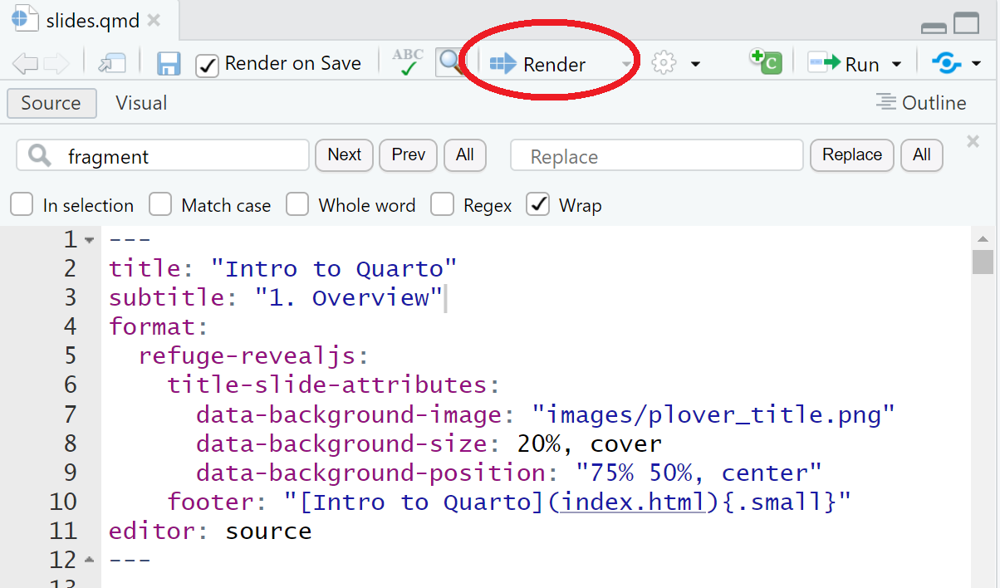{fig-alt="A screenshot of a Quarto document in RStudio. The Render button is circled in red" .drop}

{width=200 .drop fig-alt="The render icon in RStudio."}
:::
:::

::: {.column width="32%" .center}
::: {.fragment fragment-index=2}
### 2.   
**Quarto command line interface (CLI)**
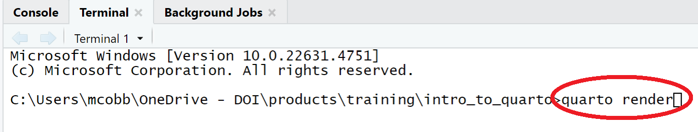{fig-alt="A screenshot of the command line terminal in RStudio. quarto render is typed in." .drop}
:::
:::

::: {.column width="36%" .center}
::: {.fragment fragment-index=3}
### 3. 
**Quarto R package**

::: {.small}
```r
quarto::quarto_render(input = ___, 
                      output_format = ___)
```
:::

:::
:::

:::

::: {.notes}
- I've covered the nuts and bolts of how Quarto works and when you should use it
- I'll now describe how to create a document from an existing Quarto file.
- The process of creating output from a Quarto file is called "rendering".
- It is a step that you will do repeatedly to view how updates to your Quarto file affect the look of your output. It's also an important step to test that your file changes are running free of errors.
- As a beginner Quarto user, you should be aware that there are 3 different approaches to rendering a Quarto file.

[click]

1. The first and most common approach is through the Rstudio application interface. After you open a Quarto file in RStudio, you will see a button on the top menu called "render". Clicking on that button will render the Quarto file and, if successful, display a preview of the output.

[click]

2. Another approach to rendering is directly calling the Quarto software using the command line interface in RStudio. To do this, switch from the R console menu to the "Terminal" menu in RStudio (usually located at the bottom righthand side of the RStudio window). Within the terminal, you type and enter "quarto render", as circled in the center image. Alternatively, you can enter "quarto preview", which will both render the document and open a preview window to view the output. This approach works free of R and (if you wanted) RStudio. A reason that you might eventually use this approach is when you want to render a document on a schedule, using Window's task scheduler. 

[click]

3. The 3rd way to render a Quarto file is using the Quarto R package. To do this, you load the Quarto R package in RStudio. Then, in the console, you would type quarto_render along with an argument in the parentheses that provide a file path to your input Quarto file and the file path where you want the output saved. You might find yourself using this approach if you want to have your document render programmatically within another function. For example, maybe you want to create an R package with a function to render your reports. Or, maybe you have a Shiny app and you want to include the ability for a user to render a Quarto report when they click a button in the app. 
:::


## Authoring in RStudio

::: columns
::: {.column width="50%" .center}

### Source editor

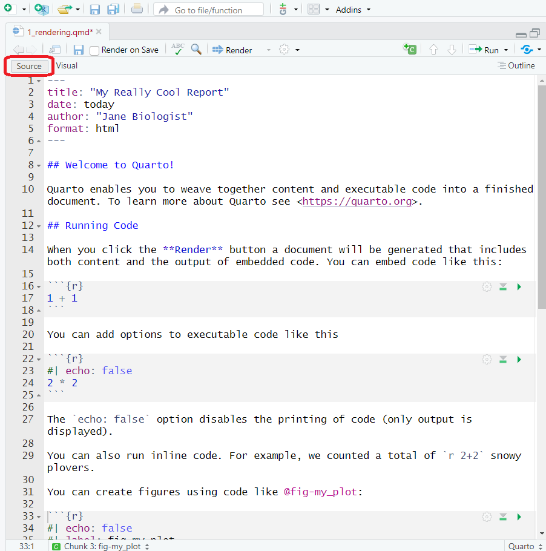{fig-alt="A screenshot of a Quarto document in RStudio viewed as Source." .drop}
:::

::: {.column width="50%" .center}

### Visual editor

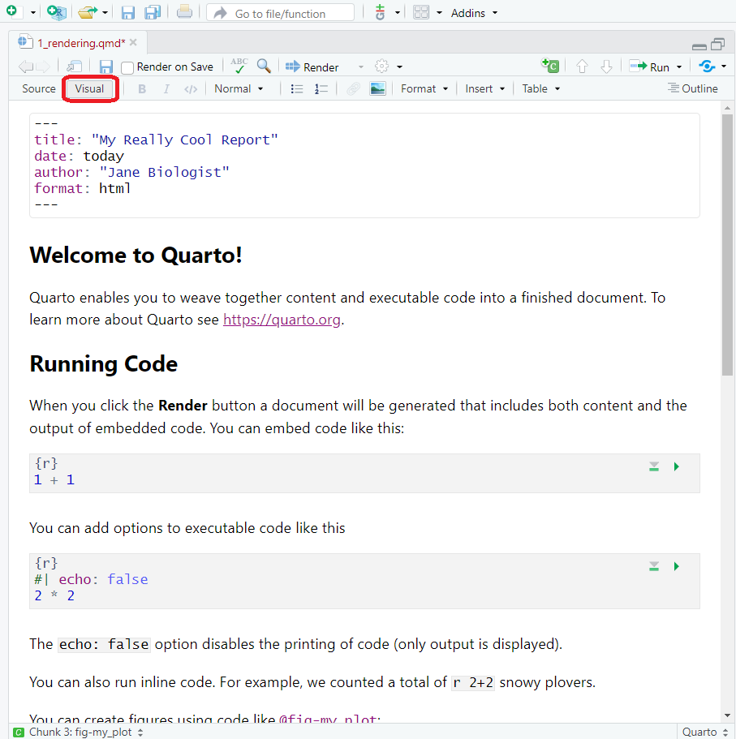{fig-alt="A screenshot of a Quarto document in RStudio viewed as Visual." .drop}
:::
:::

::: {.notes}

- For our purposes, we will be using RStudio to edit Quarto files Within RStudio. 
- There are two editors available to make changes to Quarto files: the Source editor, shown on the left and the Visual editor shown on the right. 
- You can toggle between editor modes by clicking on the buttons circled in red. 
- The source editor displays the raw Quarto file.
- It is the traditional approach to editing documents and most used by those comfortable with creating Quarto files.
- On the other hand, the Visual editor shows changes in real time and previews what the output will looks like without having to re-rendering it.
- It also provides a menu at the top of the window with buttons for things inserting tables, figures, and citations; and formatting fonts and headers. 
- It provides an easier interface for those learning Quarto and who are familiar with word processing software like Word.
:::


# Exercise 1: [Rendering](exercises.qmd#sec-exercise1){target="_blank"} {.exercise}

{fig-alt="QR code to the exercises website."}
\
\

```{r}
#| echo: false

countdown::countdown(10, bottom = 0)
```

::: {.notes}
- That brings us to our first exercise. 
- During this exercise, you will have a chance to implement some of the concepts that we just covered, including approaches to rendering Quarto files.
- Instructors are available if you need any help or have questions.
- After this exercise, we will dive into the 3 components of a Quarto file.
:::


# Anatomy of a Quarto File {.dark}

::: {.notes}
- In the last section, I introduced Quarto as an approach to creating dynamic documents that combine code and text. I outlined the process for rendering a Quarto document and discussed how that compares to R Markdown. I showed 3 approaches for rendering a Quarto document and two options for editing a Quarto document. 
- We will now move on to describing the component that make up all Quarto documents.
:::


## 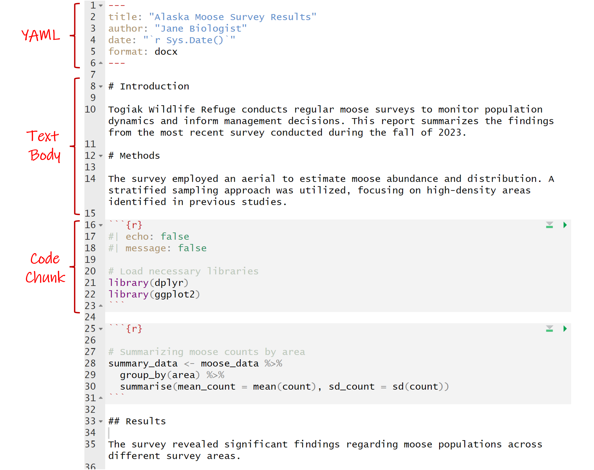

::: {.notes}
- Here's an example of a Quarto document. It shows 3 basic components of Quarto documents: metadata (YAML header), the document body, and code. In the next 3 presentations, we will cover how each of these components come together to create a Quarto document.
:::


## YAML

**Y**et **A**nother **M**arkup **L**anguage = document metadata!

::: columns

::: {.column width="50%"}
```{yml}
#| echo: TRUE
#| eval: FALSE

---
title: "Introduction to Quarto"
author: "FWS staff"
format: 
  revealjs:
    theme: [default, refuge_light.scss]
editor: source
---
```
:::

::: {.column width="50%" .small .incremental}
- Starts and ends with "\-\-\-"
- Uses key-value pairs: `key: value` that can nest
- *Picky about spacing and indentations!*
- Including options for:
  - Title, authors, date
  - File output(s) (e.g., `html`, `docx`)
  - Styling (e.g., `theme`, `fig-width`)
  - Parameters
   - And more...
:::

:::


::: {.notes}
- YAML stands for "Yet Another Markup Language"
- The purpose of the YAML header of a Quarto document is to provide document level metadata.
- Like all programming languages, it follows a standard syntax.  
[click]
-  You can recognize a YAML because it starts and ends with three dashes.
- Although a Quarto document can have multiple YAMLs, most often there is only one and it is generally located at the top of the document.  
[click]  
- As shown here, YAMLs follow a standard syntax that is composed of key value pairs.
- A simple YAML might have single key value pairs, but it is worth understanding that more complex document level formatting will often require nested key value pairs. You can see an example of that here under the format option. In our example here, we want to render the Quarto document as a revealjs presentation. Within that format, we have nested options that define a template that customizes the look of our presentation slides.   
[click]
- YAML are quite picky about spacing and indentations. If you run into YAML errors when trying to render a Quarto document, it is often due to missing spaces or indentations.
- There are many options that can be defined in a YAML. Some of the more common ones that you will use regularly include the document tile, author, date, and the desired file output. 
- Document level styles are also defined in the YAML. This includes things like the font type, sizes, and colors and the size and layout of figures.
Finally, the YAML is where you can define custom parameters. Parameters are used to create different variations of a document. For example, you might want to have seperate reports to portions of a refuge, or you might want to show results that cover a specific time period. You would define these values as parameters in the YAML header.
:::


## YAML metadata: [Options]{.gray-bold} 

::: {.incremental}
- Options are dependent on the file output (**many** options )  
- Search the [Quarto guidance](https://quarto.org/docs/reference/) within your specified file format:

::: {.fragment}
```{=html}
<iframe width="1600" height="600" src="https://quarto.org/docs/reference/formats/docx.html" title="Quarto HTML Options guidance"></iframe>
```
:::

:::

::: {.notes}
- Some YAML options available are dependent on the file format that you select. In other words, if you define the output file format as HTML, you will have certain other options available to select, but if you define the output file format as a MS Word document, there will be other options available. 
- Overall, there are a **ton** of YAML options available!
- To give you an idea, here's the Quarto guidance that shows YAML options for a Quarto document rendered to MS Word. I encourage you to visit the Quarto guidance for your selected file format to explore what options are available.
:::


## YAML metadata: [Options]{.gray-bold}

::: columns

::: {.column width="50%"}
::: {.callout-tip}
## Another option: Use your friendly assistant!
- Start a word and hit <kbd>`tab`</kbd> to complete or ...
- Type <kbd>`Ctrl+space`</kbd> to see available options.
:::
:::

::: {.column width=50%"}

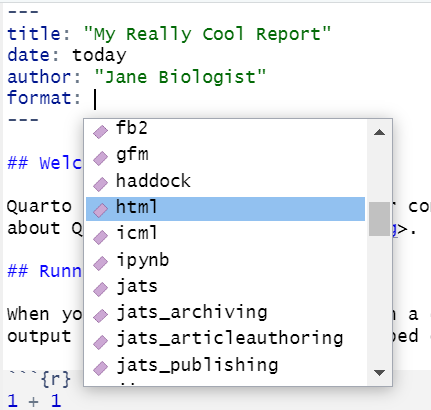{width=700 fig-alt="A screenshot of a yaml for a quarto document in RStudio showing the drop-down menu with options available." .drop}
:::

:::

::: {.notes}
- Because there are so many YAML options, it might feel a little overwhelming at first to figure out how to find what you are looking for.
- To help navigate your options, I want to mention two helpful features to consider using.
- The first tip is to use autocompletion. For those not familiar, autocompletion is a feature that fills in words that you start typing. In RStudio, autocompletion of YAML options is activated when you can press Tab after starting to type an option. Using tab completion can save you time and helps avoid YAML's picky spelling and spacing issues.
- A second tip is to view your YAML options. You can see what YAML options are available by typing Control and Space after you have entered a key value. Like you see in the image here, Control and space will bring up a dropdown menu of options to select. In this case, you see that html is an option for format.
:::


# Exercise 2: [YAML metadata](exercises.qmd#sec-exercise2){target="_blank"} {.exercise}

{fig-alt="QR code to the exercises website."}
\
\

```{r}
countdown::countdown(10, bottom = 0)
```

::: {.notes}
That bring us to the end of workshop presentation on YAML headers. We will now break for a 10 minute exercise to apply what you've learned. As always, the instructions are available on the GitHub page. If you have the slides open, you can click of the text to link to the instructions. If you have a phone, you can access the instructions using the QR code. 
:::


## Text body: Markdown

::: columns

::: {.column width="50%"}
{height="90%"}
:::

::: {.column width="50%" .incremental}
- Markdown is a markup language (e.g., HTML, teX, XML)
  - Add syntax to the text to change it's look
  - Mix text with markup instructions
- Quarto uses Pandoc Markdown
    - Inline or block elements
- Source (Markdown) vs. Visual (WYSIWYM)

:::

:::

::: {.notes}
- Now we are going to get into the body of our Quarto file
- Everything in the body, aside from our code, which we will get to later, is written in the language Markdown
  - Markdown is a markup language, which just means that it is a way for us to write out our document content in conjunction with instructions on how we want our content to look
  - This allows us to style and assemble content, like text, in a machine-readable fashion
  - Luckily, it is pretty human-readable as well
  - In short, it's how we make our product pretty
- Quarto uses Pandoc Markdown, which is very similar to (but a little different from) standard Markdown
  - One of the features of Pandoc Markdown is that it allows us to style inline elements (without impacting surrounding text or other elements)
  - OR style whole blocks of the document at once
  - And I’ll show you what I mean by this in a second
- We view our Quarto file in Markdown language when we use the “Source Editor”
  - When you switch to the "Visual Editor" (which McCrea mentioned), you are no longer seeing Markdown but instead WYSIWYM (_?), which is just a fun way of saying "What You See is What You Mean"
  - Today, I’ll be walking through Quarto’s Markdown syntax
  - However, it’s important to acknowledge that you can do many of the same things in the “Visual Editor” by highlighting things and clicking buttons much like you would when formatting your document in Microsoft word
  - Both are acceptable, and you can toggle between them, but it’s always good to know the markdown methods because it gives you a little bit more control, and I find it can be really beneficial if your formatting gets wonky in the visual mode

:::


## Text body

\
 
::: columns

::: {.column width="50%"}
### Inline elements

- Individual words in a sentence
- Images, links, equations, or code in a sentence
:::

::: {.column width="50%"}
### Block elements 

- Paragraphs or sections of a document
- Standalone images, equations, or figures
:::

:::

::: {.notes}
- Inline elements are pretty self explanatory - they are in line with other elements
  - It's content that is contiguous with other content
  - Common inline elements are words or phrases within a larger set of text, small images (like icons), hyperlinks, equations, and short code snippets
- Block elements, on the other hand, stand alone (these can be paragraphs, images, equations, or figures)
- We can style inline elements independently of what surrounds them, and we can also style whole blocks at once
  - But, inline and block styling look a little different from one another

:::


## Inline elements: [Text]{.gray-bold}

\
 
::: columns

::: {.column width="50%"}

### Markdown  

\

```{.markdown}
This is an example of how you could change  
inline elements of text body Markdown in a FWS 
report. You can make a word *italicized* or  
**bold**. You can also display code, such as  
`exp(10) + 1`. You can even ~~strikethrough~~  
and make something a subscript~1~ or
superscript^1^. For more advanced customization, 
you can use [spans]{.mark} to apply 
custom-defined or built-in attributes to 
[inline elements]{style="color:blue;"}.
```
:::

::: {.column width="50%"}

### Output  
::: {.fragment}
::: {.small}
This is an example of how you could change  
inline elements of text body Markdown in a FWS 
report. You can make a word *italicized* or  
**bold**. You can also display code, such as  
`exp(10) + 1`. You can even ~~strikethrough~~  
and make something a subscript~1~ or superscript^1^.
For more advanced customization, you can use 
[spans]{.mark} to apply custom-defined or built-in 
attributes to [inline elements]{style="color:blue;"}.
:::
:::

:::

:::

::: {.notes}
- Here’s an example showing a lot of the different options for customizing your text through inline changes
- You can use ___ for ___, …
  - Asterisk, double asterisks, back tick ....
  - You can also have inline code that is actually executed (you’ll notice here that this expression is formatted in text that looks like code but is not actually evaluated), but that’s getting outside of markdown language and styling, so we’ll come back to that later
  - You can also ..., double tilde, single tilde, caret - so many options
- You'll notice a pattern here of adding different characters to indicate certain types of styling and they are placed at both the beginning and the end so that the computer knows where to start and stop the styling
  - If you don’t know how to execute a certain type of formatting, Google is your friend – you don’t have to have all of this memorized. Most people don't.
- For more advanced, ..., here we use a spans to add highlights and change our text color by applying class and key-value pair attributes
  - If you have past HTML css experience, you may already be familiar with classes. If not, that is completely okay
  - All you should know is that you can define a set of formatting rules (let's say I want bold and blue and Comic Sans text) - I can put a tag in curly braces here that says use my formatting rules I already defined somewhere else, and apply it to everything in the preceding square brackets

:::


## Inline elements: [Math]{.gray-bold}

with LaTex!
 
::: columns

::: {.column width="50%"}

### Markdown  
```{.markdown}
The solution to $sqrt(x) = 26$ is $x = 676$ and  
$\pi = 3.1415...$.
```
:::

::: {.column width="50%"}

### Output 
::: {.fragment}
::: {.small}
The solution to $sqrt(x) = 26$ is $x = 676$ 
and $\pi = 3.1415...$.
:::
:::

:::

:::

::: {.notes}
- To make your equations look nice, you can use LaTex
- and you define the inline snippet you want to use LaTex styling for with dollar signs
- LaTex is actually another markup language, so anything within those dollar signs is NOT being evaluated as Markdown
- And it's just what is commonly used for math styling and making your math look how it's supposed to

:::


## Inline elements: [Hyperlinks and images]{.gray-bold}

\
 
::: columns

::: {.column width="50%"}
### Markdown  
  
```markdown
For more information on how to use Quarto,  
check out the [Quarto webpage](www.quarto.com).
```
  
\

::: {.fragment fragment-index=2}
```markdown
Here's an image that is inline with  
my text .
```
:::

:::

::: {.column width="50%"}
### Output
::: {.small}
::: {.fragment fragment-index=1}
For more information on how to use Quarto,  
check out the [Quarto webpage](www.quarto.com).
:::

\

::: {.fragment fragment-index=3}
Here's an image that is inline with  
my text {.center-inline}.
:::
:::

:::

:::

::: {.notes}
- Hyperlinks use square brackets for the display text, immediately followed by the URL in parentheses
  - So, “Quarto Webpage” is now a clickable link
- Images are similar, but require an exclamation mark at the beginning
  - Adding text in the square brackets is optional if you want to add a caption, but, for inline images, it will not display
  - And in parentheses, we provide the path to the file

:::


## Block elements: [Paragraphs]{.gray-bold}

::: columns
:::{.column width="50%"}
### Markdown

``` markdown
Here's a paragraph. To separate it from the next  
paragraph, you need to add one or more empty 
lines.

This is a new paragraph. A paragraph is an  
example  of a block element. You can format each  
paragraph (or a set of paragraphs) independently, 
using divs to group regions of content and apply
styling.

::: {.callout-tip}
## Custom block element  

Here's an example of a block with custom 
formatting. Everything in this block has this 
format. Specifically, this is a "callout block", 
which is a built-in feature of Quarto that uses 
div syntax.
:::
```
:::

:::{.column width="50%"}

### Output  

:::{.small}
:::{.fragment}

Here's a paragraph. To separate it from the next 
paragraph, you need to add one or more empty lines.

This is a new paragraph. A paragraph is an  
example  of a block element. You can format each  
paragraph (or a set of paragraphs) independently, 
using divs to group regions of content and apply
styling.

::: {.callout-tip}
## Custom block element

Here's an example of a block with custom formatting. Everything in this block has this format. Specifically, this is a "callout block", which is a built-in feature of Quarto that uses div syntax.
:::

:::
:::

:::
:::


::: {.notes}
- Now transitioning to block elements, I want to note that spacing is really important in Markdown language
  - often, when things go wrong, it's a spacing issue
- Creating something like paragraphs is super easy, you just need to remember to insert empty space between your blocks
- To style a block (or multiple blocks) of text, you can use divs, which are essentially the block version of spans
  - Instead of brackets, you use triple colons to define a section and provide styling directions at the top
  - In this example, we format this block as a callout block
  - These callouts are just a fun, little, built-in feature of Quarto
    - There are 5 types of callouts (note, tip, warning, caution, and important) – this example is a tip
    - And they all have their own color and icon
    - When we add a header to the block, Quarto knows to make that text the banner in the callout
- Nesting styling is also possible. You can create divs within divs
  - For example, this very slide
  - Since this is a Quarto presentation, written entirely in a qmd file, the same rules apply
  - We use colons to define a section to be a single presentation slide, and then we also define subsections to create each of these two columns within the slide
  

:::


## Block elements: [Headers]{.gray-bold} 

\

+---------------------+-----------------------------------+
| Markdown Syntax     | Output                            |
+=====================+===================================+
|     # Header 1      | # Header 1 {.heading-output}      |
+---------------------+-----------------------------------+
|     ## Header 2     | ## Header 2 {.heading-output}     |
+---------------------+-----------------------------------+
|     ### Header 3    | ### Header 3 {.heading-output}    |
+---------------------+-----------------------------------+
|     #### Header 4   | #### Header 4 {.heading-output}   |
+---------------------+-----------------------------------+

::: {.notes}
- Headers are similar to headers in Word where there are different levels corresponding to text size and boldness
- The header level is indicated by the number of hashtags (or pound signs) you use
  - So if you use 1 hashtag, it is a level 1 header, and so on

:::


## Block elements: [Lists]{.gray-bold}

\

::: columns

::: {.column width="50%"}
### Markdown 

```{.markdown}
**Ordered List**

1. This item first
2. Then this one
3. And finally this
```

\ 

::: {.fragment fragment-index=2}
```{.markdown}
**Unordered List**

- Kodiak Refuge
- Togiak Refuge
- Arctic Refuge
```
:::

:::

::: {.column width="50%"}

### Output

::: {.small}
::: {.fragment fragment-index=1}
**Ordered List**

1. This item first
2. Then this one
3. And finally this
:::

::: {.fragment fragment-index=3}
**Unordered List**

- Kodiak Refuge
- Togiak Refuge
- Arctic Refuge
:::
:::

:::

:::

::: {.notes}
- Lists are pretty straightforward
  - A numbered list is made exactly how you would expect it to be
  - Standard bullet points are indicated with dashes
- You just want to be careful of spacing and choice of characters here

:::


## Block elements: [Math]{.gray-bold}

with LaTex!
 
::: columns

::: {.column width="50%"}

### Markdown  
```{.markdown}
The Cauchy-Schwarz Inequality

$$
\left( \sum_{k=1}^n a_k b_k \right)^2 
\leq 
\left( \sum_{k=1}^n a_k^2 \right) 
\left( \sum_{k=1}^n b_k^2 \right)
$$
is an upper bound on the inner product between  
two vectors in an inner product space in terms  
of the product of the vector norms.
```
:::

::: {.column width="50%"}

### Output  

:::{.fragment}
::: {.small}
The Cauchy-Schwarz Inequality

$$
\left( \sum_{k=1}^n a_k b_k \right)^2 \leq \left( \sum_{k=1}^n a_k^2 \right) \left( \sum_{k=1}^n b_k^2 \right)
$$
is an upper bound on the inner product between two vectors in an inner product space in terms of the product of the vector norms.
:::
:::

:::

:::

::: {.notes}
- To write out more substantial equations, you do the same thing as before, but use double dollar signs to enclose the LaTex block
- Again, everything within this block is LaTex code
  - So to know how to write out these equations, you’ll want to Google a LaTex guide

:::


## Block elements: [Images]{.gray-bold}

\

::: columns

::: {.column width="50%"}
### Markdown
```{.markdown}
Here's a paragraph of text. We describe
something of great importance. So great,
in fact, that we need to also include an image. 


Moving along, we will describe something else. 
```
:::

::: {.column width="50%"}
### Output
::: {.small .fragment}
Here's a paragraph of text. We describe  
something of great importance. So great,  
in fact, that we need to also include an image. 

{width="30%"}

Moving along, we will describe something else. 
:::
:::

:::

::: {.notes}
- To add an image on its own line, it is exactly the same as before
- Just add empty lines before and after to make it clear that the image should be treated as its own block

:::


# Exercise 3: [Document body](exercises.qmd#sec-exercise3){target="_blank"} {.exercise}

{fig-alt="QR code to the exercises website."}
\
\

```{r}
countdown::countdown(10, bottom = 0)
```

::: {.notes}

:::


## Code chunks: [Pandoc]{.gray-bold}

\

::: columns

::: {.column width="50%"}  
````markdown
```language
Some code here
```
````
:::

::: {.column width="50%"}
:::{.small .incremental}
- Code chunk surrounded by a "fence" of three backticks ` ``` `
- Specifying the language allows for syntax highlighting.
- Code is displayed but not executed
:::
:::

:::

::: {.notes}
In this section, we'll delve into one of the final elements of a Quarto document: inline code and code blocks, commonly known as code chunks.

These components enable us to seamlessly integrate data analyses, visualizations, and computations right within the Quarto document, enhancing our interactive capabilities and improving reproducibility.

Let's break down the structure of a code chunk and walk through how its processed:

Earlier, we saw that by surrounding our YAML header with three hyphens we signaled to Pandoc that the text should be interpreted as a YAML header rather than regular text. Similarly, with code chunks we need to signal to Pandoc that the text in our code chunk is code and not regular text. We do this by surrounding  our code chunk three backticks (```).

We also need to tell Pandoc what coding language the text within our code chunk uses so we include the programming language after the initial three backticks.
:::


## Code chunks: [R Markdown]{.gray-bold} {auto-animate="true"}

\

::: columns

::: {.column width="50%"}
    ```{{r, echo=FALSE}}
    Some code here
    ```
:::

::: {.column width="50%"}
::: {.small}
- Code chunk surrounded by a "fence" of three backticks ` ``` `  
- Specifying the language allows for syntax highlighting.
- ~~Code is displayed but not executed~~ Code executes unless you specify as an option -> brackets`{}`
- Chunk options are a comma-separated list (R syntax)
:::
:::

:::

::: {.notes}
By including the programming language, Pandoc will be able to read the code chunk but the language must be enclosed in curly brackets for the code to be executed unless otherwise specified in the code chunk options.

For those of you familiar with RMarkdown, you might recall that code chunk options were traditionally included in the curly brackets after specifying the r language, using commas to separate each option.
:::


## Code chunks: [Quarto]{.gray-bold} {auto-animate="true"}

\

::: columns

::: {.column width="50%"}
    ```{{language}}
    #| echo: false
    
    Some code here
    ```
:::

::: {.column width="50%"}
::: {.small}
- Code chunk surrounded by a "fence" of three backticks ` ``` `
- Specifying the language allows for syntax highlighting.
- ~~Code is displayed but not executed~~ Code executes unless you specify as an option -> brackets`{}`
- ~~Chunk options are a comma-seperated list (R syntax)~~ Chunk options moved to a YAML in the cell after a hash pipe `#|`
    + Wider language support
    + Easier to read
:::
:::

:::

::: {.notes}
In Quarto, the language is still specified in the curly brackets; however, the chunk options are organized in a YAML format within the code chunk. Each code chunk option is placed on its own line, prefaced by a hashtag and pipe. This update supports a variety of programming languages and makes the code chunk easier to read.

For those of you not familiar with code chunk options, don't worry, we'll cover these in a minute. 
:::


## Code chunks: [Labels]{.gray-bold} {auto-animate="true"}

\

::: columns

::: {.column width="50%"}
- Identifies code chunks
    - Makes debugging easier
    - Can reference code chunk outputs in the text
:::

::: {.column width="50%" .fragment}
\

```{{r}}
label: summary-plot

Some code to generate a plot...
```
:::

:::

\

::: {.fragment}
:::{.callout-tip title="Avoid using underscores (_) in labels and IDs."}
This can cause problems when rendering to PDF with LaTeX. 
:::
:::

::: {.notes}
Another significant improvement in Quarto is the inclusion of code chunk labels within the YAML of the cell instead of the curly brackets. 

Labels should be short and descriptive; providing reader's context about what's contained in the code chunk or what it does. Labeling chunks enhances document organization, simplifies debugging, and facilitates referencing code chunk outputs in the text, which is especially valuable when creating and referencing figures and tables in manuscripts or reports.

A best practice to keep in mind is to refrain from using underscores in code chunk labels, as this can lead to rendering issues, particularly with LaTeX.
:::


## Execution options: [Outputs]{.gray-bold}

\

::: {.small}
| Option    | Description                                                                                                                                                                                       |
|-----------|------------------------------------------------------------|
| `eval`    | Evaluate the code chunk (if `false`, just echos the code into the output).                                                                                                                        |
| `echo`    | Include the source code in output                                                                                                                                                                 |
| `output`  | Include the results of executing the code in the output (`true`, `false`, or `asis` to indicate that the output is raw markdown and should not have any of Quarto's standard enclosing markdown).  |
| `warning` | Include warnings in the output.                                                                                                                                                                   |
| `error`   | Include errors in the output.                                                                                                                                                                     |
| `include` | Catch all for preventing any output (code or results) from being included (e.g. `include: false` suppresses all output from the code block).                                                  |
:::

\

:::{.fragment}
::: {.callout-tip title="Tab Completion is your friend!"}

:::
:::

::: {.notes}
I mentioned code chunk options earlier and want to circle back to these to provide more information. Code chunk options are parameters that modify the behavior of code chunks in your Quarto documents. 

Code chunk options can control various aspects of code execution and output display.

Would you like the code in your code chunk to be run? If not, set eval equal to FALSE.

Would you like the source code to be displayed in the output? If not, set the option equal to FALSE.

Maybe your code produces a figure or table, you can designate whether or not they are displayed in the rendered document using the output option. 

Warnings and errors produced by your code will be rendered unless you update the warning and error options.

Or, you can set the "include" parameter to "FALSE" and all output from the code will be suppressed.

Having trouble remembering all of the code chunk options available? In Rstudio if you hit the tab key after the hashpipe a dropdown menu with all available options will be listed.
:::

## Execution options: [Figures]{.gray-bold} {auto-animate="true"}

\

::: columns
::: {.column width="50%"}

### Markdown 

```{{r}}
library(ggplot2)

ggplot(iris, aes(x = Petal.Width, 
                 y = Petal.Length)) +
  geom_point() +
  labs(x = "Petal width",
       y = "Petal length")
```
:::

::: {.column width="50%" .fragment}

### Output

```{r}
#| echo: true

library(ggplot2)

ggplot(iris, aes(x = Petal.Width, 
                 y = Petal.Length)) +
  geom_point() +
  labs(x = "Petal width",
       y = "Petal length")
```
:::
:::


::: {.notes}
Let's walk through an example together.

First, we surround our code in three backticks to let Pandoc know the text in this chunk is code and not regular text. Then, we specify our coding language as r between curly brackets after the first three backticks. 

Our code then loads the ggplot2 package and plots petal width vs. petal length using the iris data.

When we render this document, our output will produce the code, the figure the code generated, and any error or warnings the code could encounter.
:::


## Execution options: [Figures]{.gray-bold} {auto-animate="true"}

\

::: columns
::: {.column width="50%"}

### Markdown 

```{{r}}
#| echo: false

library(ggplot2)

ggplot(iris, aes(x = Petal.Width, 
                 y = Petal.Length)) +
  geom_point() +
  labs(x = "Petal width",
       y = "Petal length")
```
:::

::: {.column width="50%" .fragment}

### Output 

```{r}
#| echo: false

library(ggplot2)

ggplot(iris, aes(x = Petal.Width, 
                 y = Petal.Length)) +
  geom_point() +
  labs(x = "Petal width",
       y = "Petal length")
```
:::
:::


::: {.notes}
Let's run that same code chunk again but this time we'll include the echo = false code chunk option.

By adding our echo option and specifying it as false, our output no longer includes the source code.
:::


## Execution options: [Figures]{.gray-bold} {auto-animate="true"}

\

::: columns
::: {.column width="50%"}

### Markdown 

```{{r}}
#| echo: false
#| fig-width: 3
#| fig-height: 2

library(ggplot2)

ggplot(iris, aes(x = Petal.Width, 
                 y = Petal.Length)) +
  geom_point() +
  labs(x = "Petal width",
       y = "Petal length")

```
:::

::: {.column width="50%" .fragment}

### Output

```{r}
#| echo: false
#| fig-width: 3
#| fig-height: 2

library(ggplot2)

ggplot(iris, aes(x = Petal.Width, 
                 y = Petal.Length)) +
  geom_point() +
  labs(x = "Petal width",
       y = "Petal length")

```
:::
:::


::: {.notes}
We can also use code chunk options to adjust the width and height of the figure.
Here we set the figure width to 3 and the figure height to 2. 
:::


## Execution options: [Figures]{.gray-bold} {auto-animate="true"}

\

::: columns
::: {.column width="50%"}

### Markdown 

```{{r}}
#| echo: false
#| fig-width: 5
#| fig-height: 5

library(ggplot2)

ggplot(iris, aes(x = Petal.Width, 
                 y = Petal.Length)) +
  geom_point() +
  labs(x = "Petal width",
       y = "Petal length")
```
:::

::: {.column width="50%"}

### Output

```{r}
#| echo: false
#| fig-width: 5
#| fig-height: 5

library(ggplot2)

ggplot(iris, aes(x = Petal.Width, 
                 y = Petal.Length)) +
  geom_point() +
  labs(x = "Petal width",
       y = "Petal length")

```
:::
:::


::: {.notes}
Or we can make the figure larger by setting the figure width and height to 5.
:::


## Execution options: [Figures]{.gray-bold} {auto-animate="true"}

\

::: columns
::: {.column width="50%"}

### Markdown 

```{{r}}
#| echo: false
#| fig-width: 5
#| fig-height: 5
#| fig-cap: "This is my really neat plot."

library(ggplot2)

ggplot(iris, aes(x = Petal.Width, 
                 y = Petal.Length)) +
  geom_point() +
  labs(x = "Petal width",
       y = "Petal length")

```
:::

::: {.column width="50%" .fragment}

### Output

```{r}
#| echo: false
#| fig-width: 5
#| fig-height: 5
#| fig-cap: "This is my really neat plot."

library(ggplot2)

ggplot(iris, aes(x = Petal.Width, 
                 y = Petal.Length)) +
  geom_point() +
  labs(x = "Petal width",
       y = "Petal length")

```
:::
:::

::: {.notes}
Let's add a caption to our figure using the fig-cap option. 
:::


## Execution options: [YAML]{.gray-bold} {auto-animate="true"}

\

::: columns

::: {.column width="60%"}
::: {.callout-tip title="Execution options at the document level in the YAML
"}
Avoids having to reapply options for each code chunk! 
:::
:::

::: {.column width="40%" .fragment}
```yaml
---
title: "My FWS Report"
author: Jane Biologist
format: html
---
```
:::

:::

:::{.notes}
If you'd like to apply the same code chunk options to all code chunks throughout the document, you can add them in the document's YAML rather than adding them to every code chunk.

Here's an example of a very basic YAML header.
:::


## Execution options: [YAML]{.gray-bold} {auto-animate="true"}

\

::: columns

::: {.column width="60%"}
::: {.callout-tip title="Execution options at the document level in the YAML
"}
Avoids having to reapply options for each code chunk! 
:::
:::

::: {.column width="40%"}
```yaml
---
title: "My FWS Report"
author: Jane Biologist
format:
  html:
    fig-width: 5
    fig-height: 5
execute:
  echo: false
---
```
:::

:::

:::{.notes}
Now lets update our header to specify that we don't want source code included in the output of any of our code chunks by setting echo to false and that any figures created should have a height and width set to 5. 
:::


## Inline elements: [Code]{.gray-bold}

\

::: columns

::: {.column width="50%"}

### Markdown 

```{source code}
#| echo: TRUE
#| eval: FALSE

This is an example of how you could use
code to calculate and report that the species
in the iris dataset with the longest sepal 
length is the 
`r iris[which.max(iris$Sepal.Length), "Species"]`.
```
:::

::: {.column width="50%"}

### Output  

::: {.fragment}
::: {.small}
This is an example of how you could use
code to calculate and report that species
in the iris dataset with the longest sepal
length is the `r iris[which.max(iris$Sepal.Length), "Species"]`.
:::
:::

:::

:::

::: {.notes}
The final concept we'll cover regarding code is inline code. Previously, we explored inline elements to modify font styles, embed images, and add hyperlinks; however, we can also incorporate code directly within the text of the document.

Similar to our code chunks, we need to tell Pandoc that the text we're adding is code and not regular text. To achieve this, we wrap our code in single backticks. After the initial backtick, we specify our coding language, allowing Quarto to understand how to process the code. 

By using both inline code and code chunks, Quarto documents become highly dynamic and powerful tools for presenting information.
:::

# Exercise 4: [Code](exercises.qmd#sec-exercise4){target="_blank"} {.exercise}

{fig-alt="QR code to the exercises website."}
\
\

```{r}
countdown::countdown(10, bottom = 0)
```


## Why and [HOW]{.gray-bold} Should I Use Quarto?

::: columns

::: {.column width="30%"}

::: {layout="[[-1], [1], [-1]]"}
{height="90%" fig-alt="A notebook that says 'What's Next' with a large question mark atop a yellow desk. Licensed under Creative Commons."}
:::

:::

::: {.column width="70%" .small}
### Practical Applications for FWS Biologists
- Generate reusable, **automated reports**
- Utilize shareable, **standardized templates**
- **Annotate code** for interpretability, collaboration, and longevity
- Track and collaborate with **version control**
- Seamlessly **integrate figures, tables, and citations** into your works
- Create dynamic, **interactive visualizations**
- Publish across **multiple formats** from a single source
- Build script-based **data pipelines** - from data collection to reporting

**Leading to...** efficiency, standardization, reduced error, reproducible science, innovation!

:::

:::

::: {.notes}
- So why should you use Quarto and what could it look like for you?
- It can look like automated, reusable reports for repeated monitoring surveys
  - Where you swap input files and generate all new calculations, summaries, and figures for the next year in an instant
  - You can also generate exploratory data analysis reports, not just final survey reports
- You can use templates for standardized Refuge reports or for your manuscripts for journal submission
- Being able to annotate code in a really human-readable format is really powerful and means you can be more collaborative with your code. The code can be used by others and its interpretability won't be lost with time or turnover
- Quarto makes it easy to collaborate and incorporate version control with Git and GitHub, which is always a best practice and good for findability if you make discoverable repos
- You can much more easily configure and update your figures and tables within documents, plus seamlessly embed citations and references
- You can create dynamic reports or presentations with interactive maps, plots, and other features, which is super cool and pretty exclusive to Quarto
- You can render multiple types of products and formats from a single qmd file for different audiences
- And you can build up a super efficient data pipeline, that goes all the way from beginning to end, especially if you use data collection apps that can feed into something like this, you auto-generate a quarto report, and that auto-updates a servcat reference - you can create a smooth, consistent workflow
-If you listened to all this and are still thinking: "I'm never going to use this" - too bad! Because you are going to make your first quarto document from scratch right now.

:::

# Exercise 5: [Your turn](exercises.qmd#sec-exercise5){target="_blank"} {.exercise}

{fig-alt="QR code to the exercises website."}
\
\

```{r}
countdown::countdown(10, bottom = 0)
```


## Wrap up

::: columns

::: {.column width="50%"}
{width=700 fig-alt="A Quarto spaceship launching into space with documents and reports floating around it."}
:::

::: {.column width="50%"}
- Quarto is a powerful tool for creating scientific documents, presentations, and websites.
- Three basic components of a Quarto file control the rendered output:
    - YAML metadata
    - Text body
    - Code chunks
- Once you understand the basics,  the sky's the limit!
:::

:::

## {.center background-image="images/plover_question.png" background-size="contain"}

